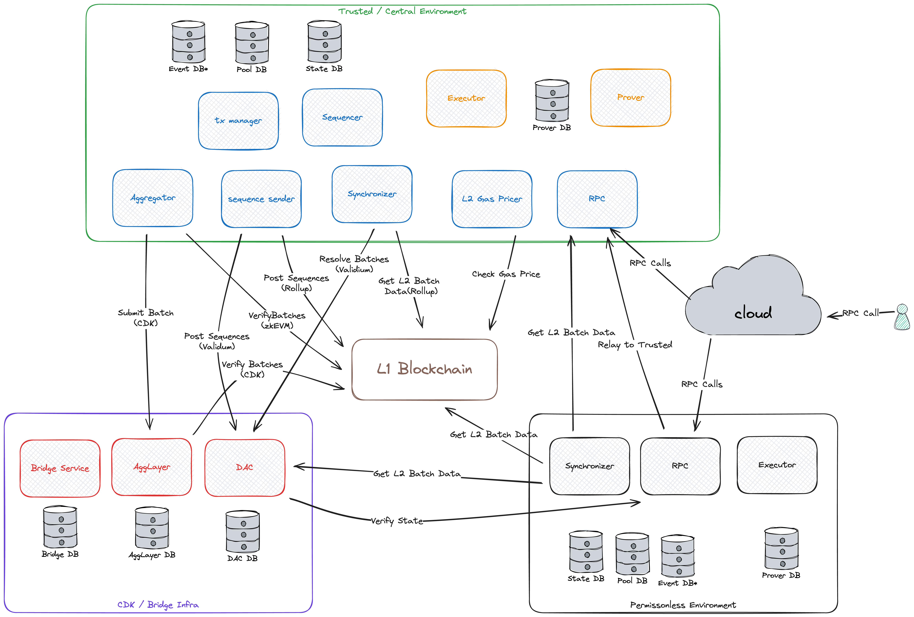

# screenshots proof:
   
  
   


# imp data:
Sequencer:0x931cAeC64617FC3fe9bDd942E3593EEc134656f5

aggregator:0x3DA95A64CdD783C25A118Ea9417eEf55ec06a7F8

admin access:0x61984609f38E14dDB0bfebb52c59364d5Ee381C0
## zkevm addresses:
  
zkevm_l2_sequencer_address: "0x931cAeC64617FC3fe9bDd942E3593EEc134656f5"
  zkevm_l2_sequencer_private_key: "0xa66a964d72b48e8e7452e7388791ef0c5a607b2c4d1271985e6469609348567c"

  zkevm_l2_aggregator_address: "0x3DA95A64CdD783C25A118Ea9417eEf55ec06a7F8"
  zkevm_l2_aggregator_private_key: "0x94f8b61fdcceed1c1ed2abb8745f9a336dbe5d53b7b47a3870932cfd3a69d3f8"

  zkevm_l2_claimtxmanager_address: "0x73537bC84E059a1c9eC12dEA535645c86B9Fa5A3"
  zkevm_l2_claimtxmanager_private_key: "0x810f8f9012a2ec40ff837c324a062ef11590f79700960a3e55e4fc6d9ff408c9"

  zkevm_l2_timelock_address: "0x5b06837A43bdC3dD9F114558DAf4B26ed49842Ed"
  zkevm_l2_timelock_private_key: "0x183c492d0ba156041a7f31a1b188958a7a22eebadca741a7fe64436092dc3181"

  zkevm_l2_admin_address: "0x61984609f38E14dDB0bfebb52c59364d5Ee381C0"
  zkevm_l2_admin_private_key: "0x0819228f44d4aa802f9636b8324381e16ad14471a476650be8acdeb264a333c5"

  zkevm_l2_loadtest_address: "0x325BB230670D93F53f7ada4041b589B11339a1E2"
  zkevm_l2_loadtest_private_key: "0x2230286aef741d5bb03e11f2666a9e6dbc33944659c3bd5f3e641f53884164bf"

  zkevm_l2_agglayer_address: "0xd7b11584aBD02d9251ae9C5860691743D10E213d"
  zkevm_l2_agglayer_private_key: "0xcbc4ef41af4a70bd52b9222f7f7304b909ec80b6f022364977f5eb2e5630eea9"

  zkevm_l2_dac_address: "0x049F8c74592Bb59Efb4D195834e657832D63d7B7"
  zkevm_l2_dac_private_key: "0xa09eb655285784bf121aec12bcc5a3085f1b2d2d8c75ba13e80c526182cc731d"

  zkevm_l2_proofsigner_address: "0xe97481c4723f2325d4DfE322AFbECFcd848Fd1f2"
  zkevm_l2_proofsigner_private_key: "0x4aa53a5b2e7230e9d6804ae2769e0221cc03b6eaf3675fead72d6ab907dbe3b5


# Polygon CDK Kurtosis Package

A [Kurtosis](https://github.com/kurtosis-tech/kurtosis) package that deploys a private, portable, and modular Polygon CDK devnet.

## Getting Started



To begin, you will need to install [Docker](https://docs.docker.com/get-docker/) and [Kurtosis](https://docs.kurtosis.com/install/).

You will also need a few other tools. Run this script to check if you have the required versions:

```bash
./scripts/tool_check.sh
```

Once that is good and installed on your system, you can run the following command to deploy the complete CDK stack locally.

This process typically takes around ten minutes.

```bash
kurtosis clean --all
kurtosis run --enclave cdk-v1 --args-file params.yml --image-download always .
```

The command above deploys a CDK stack using [cdk-erigon](https://github.com/0xPolygonHermez/cdk-erigon) as a sequencer.

Let's do a simple L2 RPC test call.

First, you will need to figure out which port Kurtoiss is using for the RPC. You can get a general feel for the entire network layout by running the following command:

```bash
kurtosis enclave inspect cdk-v1
```

That output, while quite useful, might also be a little overwhelming. If you want to simply see the port mapping within the `cdk-v1` enclave for the `zkevm-node-rpc` service and the `trusted-rpc` port, you can use the following command. For this test, let's store the RPC URL in an environment variable:

```bash
export ETH_RPC_URL="$(kurtosis port print cdk-v1 cdk-erigon-node-001 http-rpc)"
```

That is the same environment variable that `cast` uses, so you should now be able to run this command. Note that the steps below will assume you have the [Foundry toolchain](https://book.getfoundry.sh/getting-started/installation) installed.

```bash
cast block-number
```

By default, the CDK is configured in `test` mode, which means there is some pre-funded value in the admin account with address `0xE34aaF64b29273B7D567FCFc40544c014EEe9970`.

```bash
cast balance --ether 0xE34aaF64b29273B7D567FCFc40544c014EEe9970
```

Okay let’s send some transactions...

```bash
export PK="0x12d7de8621a77640c9241b2595ba78ce443d05e94090365ab3bb5e19df82c625"
cast send --legacy --private-key "$PK" --value 0.01ether 0x0000000000000000000000000000000000000000
```

Okay let’s send even more transactions... Note that this step will assume you have [polygon-cli](https://github.com/maticnetwork/polygon-cli) installed.

```bash
polycli loadtest --rpc-url "$ETH_RPC_URL" --legacy --private-key "$PK" --verbosity 700 --requests 50000 --rate-limit 50 --mode t --concurrency 5
polycli loadtest --rpc-url "$ETH_RPC_URL" --legacy --private-key "$PK" --verbosity 700 --requests 500 --rate-limit 10 --mode t
polycli loadtest --rpc-url "$ETH_RPC_URL" --legacy --private-key "$PK" --verbosity 700 --requests 500 --rate-limit 10 --mode 2
polycli loadtest --rpc-url "$ETH_RPC_URL" --legacy --private-key "$PK" --verbosity 700 --requests 500 --rate-limit 3  --mode uniswapv3
```

Pretty often, you will want to check the output from the service. Here is how you can grab some logs:

```bash
kurtosis service logs cdk-v1 zkevm-agglayer-001
```

In other cases, if you see an error, you might want to get a shell in the container to be able to poke around.

```bash
kurtosis service shell cdk-v1 zkevm-node-sequencer-001
```

One of the most common ways to check the status of the system is to make sure that batches are going through the normal progression of trusted, virtual, and verified:

```bash
cast rpc zkevm_batchNumber
cast rpc zkevm_virtualBatchNumber
cast rpc zkevm_verifiedBatchNumber
```

If the number of verified batches is increasing, then it means the system works properly.

To access the `zkevm-bridge` user interface, open this URL in your web browser.

```bash
open $(kurtosis port print cdk-v1 zkevm-bridge-proxy-001 web-ui)
```

When everything is done, you might want to clean up with this command which stops everything and deletes it.

```bash
kurtosis clean --all
```

For more information about the CDK stack and setting up Kurtosis, visit our [documentation](https://docs.polygon.technology/cdk/) on the Polygon Knowledge Layer.

## Contact

- For technical issues, join our [Discord](https://discord.gg/0xpolygonrnd).
- For documentation issues, raise an issue on the published live doc at [our main repo](https://github.com/0xPolygon/polygon-docs).

## License

Copyright (c) 2024 PT Services DMCC

Licensed under either:

- Apache License, Version 2.0, ([LICENSE-APACHE](./LICENSE-APACHE) or http://www.apache.org/licenses/LICENSE-2.0), or
- MIT license ([LICENSE-MIT](./LICENSE-MIT) or http://opensource.org/licenses/MIT)

as your option.

The SPDX license identifier for this project is `MIT` OR `Apache-2.0`.

## Contribution

Unless you explicitly state otherwise, any contribution intentionally submitted for inclusion in the work by you, as defined in the Apache-2.0 license, shall be dual licensed as above, without any additional terms or conditions.


